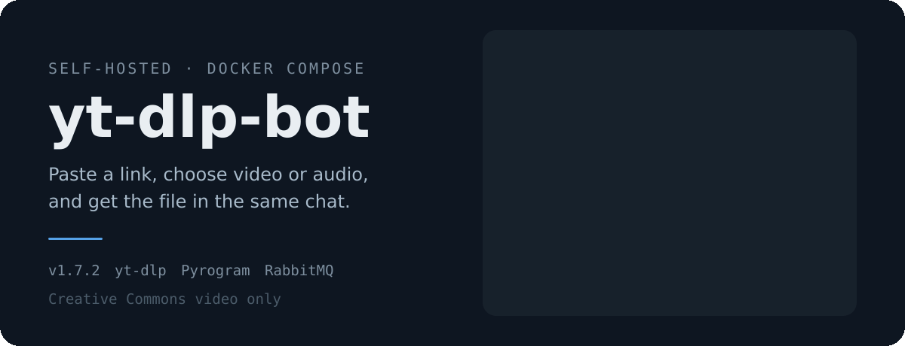
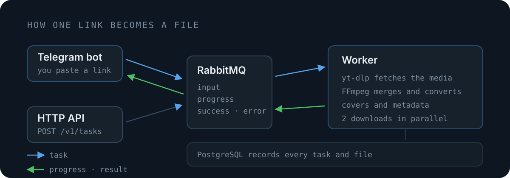

<p align="center">
  
</p>

<p align="center">
  <b>Self-hosted Telegram bot for <a href="https://github.com/yt-dlp/yt-dlp">yt-dlp</a>.</b>
  Runs on your own machine with Docker Compose. 🇺🇦
</p>

<p align="center">
  Version 1.7.2 · <a href="RELEASES.md">Release notes</a> ·
  Intended for videos under a Creative Commons licence
</p>

---

## Support the development

- [Buy me a coffee](https://www.buymeacoffee.com/terletsky)
- PayPal [](https://www.paypal.com/cgi-bin/webscr?cmd=_s-xclick&hosted_button_id=MA6RKYAZH9DSA)
- Bitcoin `14kMRS8SvfD2ydMSMEyAmefHV3Yynf9kAd`

## What it does

Send a link to your bot. It asks what you want, downloads it, and sends the file
back — no browser, no desktop app, no files left on someone else's server.

- **Choose per download** — video, audio, or both; quality from 360p to 4K.
- **One status message** — a single message tracks the task from percentage and
  ETA through processing to upload, then makes way for the file itself.
- **Files that look right in Telegram** — source covers survive as thumbnails,
  and audio arrives tagged with its artist and track.
- **Chapters you can jump to** — when the source has them, the timestamps come
  along and Telegram seeks the file when you tap one.
- **Readable failures** — a suspended account, a private video or an expired
  cookie is explained in a sentence instead of a stack trace.
- **Speaks fifteen languages** — set one for everyone, or a different one per
  person.
- **Run it from the chat** — admins add users and change settings without
  touching the server.
- **Works headless too** — the same downloads can be triggered over HTTP.

## How it works

<p align="center">
  
</p>

Four services share one queue. The bot owns the conversation, the worker owns
the downloading, and neither blocks the other — so a three-hour video does not
stop the bot from answering.

## Quick start

**1. Get your Telegram credentials**

- Create a bot with [BotFather](https://t.me/BotFather) and copy its `token`.
- Get an `api_id` and `api_hash` from [my.telegram.org/apps](https://my.telegram.org/apps).
- Find [your Telegram user ID](https://stackoverflow.com/questions/32683992/find-out-my-own-user-id-for-sending-a-message-with-telegram-api).

**2. Write the config**

```bash
cp app_bot/config-example.yml app_bot/config.yml
```

Put the `token`, `api_id` and `api_hash` in place of the placeholders, then set
your own ID under `allowed_users` → `id`.

**3. Run it**

```bash
docker compose build base-image
docker compose up --build -d -t 0 && docker compose logs --tail 100 -f
```

The bot greets you with `✨ <YOUR_BOT_NAME> started, paste a video URL(s) to
start download`. Paste a link and it takes over from there.

Stop everything with `docker compose stop -t 0`.

**Rolling out changes later**

`redeploy.sh` rebuilds, restarts, and reclaims the disk space each rebuild
orphans — untagged images and excess build cache accumulate quietly until an
unrelated-looking service fails for want of space.

```bash
./redeploy.sh                 # rebuild and restart every application service
./redeploy.sh yt_bot          # only one service
./redeploy.sh --pull --base   # update the branch and rebuild the base image too
./redeploy.sh --clean-only    # just reclaim space
./redeploy.sh --help          # all options
```

## Telegram commands

Anyone allowed in the config can paste links. Admins get the rest:

| Command | What it does |
|---|---|
| `/adduser <telegram_id>` | Add a user with default settings |
| `/deleteuser <telegram_id>` | Remove a user — admins are protected |
| `/listusers` | Show everyone currently configured |
| `/config get <path>` | Read a value, e.g. `/config get telegram.max_upload_tasks` |
| `/config set <path> <value>` | Change a value, e.g. `/config set telegram.max_upload_tasks 5` |
| `/reloadconfig` | Re-read `config.yml` from disk |
| `/restartbot` | Restart the bot; Docker brings it back |

Changes are written to `config.yml` and survive a restart.

## Configuration

Per-user behaviour lives in `app_bot/config.yml`; service behaviour lives in
`envs/`.

**Where downloads are kept.** `STORAGE_PATH` in `envs/worker.env` is
`/filestorage` inside the container. Map it to a real directory for the
`yt_worker` service in `docker-compose.yml`:

```yml
  yt_worker:
    volumes:
      - "D:/Videos:/filestorage"
```

**Temporary space.** Downloads are staged in the `shared-tmpfs` volume, which is
**RAM-backed** and declared at 7 GB in `docker-compose.yml`. Size it below the
memory your host can spare — see below if that is not much.

**Upload limits.** Telegram accepts 2 GB per file, or 4 GB with Premium. That
ceiling is `upload_video_max_file_size` in `config.yml`.

**Download speed.** Unlimited by default. `DOWNLOAD_RATE_LIMIT` in
`envs/worker.env` accepts a per-download rate such as `500K` or `4.2M`. It
applies to each download, so `2M` with `MAX_SIMULTANEOUS_DOWNLOADS=2` can still
use 4 MB/s in total.

**Parallel downloads.** `MAX_SIMULTANEOUS_DOWNLOADS` in `envs/worker.env`,
default 2. Raise it with the temporary space above in mind.

**Thumbnails.** `yt-dlp` keeps the source cover when it matches the video's
shape. Otherwise FFmpeg grabs a frame at `THUMBNAIL_FRAME_SECOND` seconds
(`envs/worker.env`), or at the midpoint for shorter videos.

**yt-dlp options.** Copy `app_worker/ytdl_opts/default.py` to `user.py` and edit
it; the [full option list](https://github.com/yt-dlp/yt-dlp/blob/master/yt_dlp/YoutubeDL.py#L180)
is upstream.

**Language.** Everything the bot says — buttons, progress, errors, admin
replies — is translated. `telegram.lang_code` in `config.yml` sets the language
for everyone; any user may choose their own:

```yml
telegram:
  lang_code: !!str "en"          # the default for everyone
  allowed_users:
    - id: 11111111111
      lang_code: !!str "uk"      # except this one
```

Available: `en` English, `be` Belarusian, `de` German, `el` Greek, `es` Spanish,
`fr` French, `he` Hebrew, `it` Italian, `kk` Kazakh, `lt` Lithuanian,
`lv` Latvian, `ru` Russian, `sr` Serbian (Cyrillic), `tt` Tatar,
`uk` Ukrainian. Anything else is rejected at startup with the list of valid values rather than
silently falling back. A translation missing a string falls back to English and
says so in the log.

Admins can switch the default without restarting:
`/config set telegram.lang_code uk`.

Translations live in `app_bot/bot/locales/<language>.json`. To add a language,
copy `en.json`, translate the values, and add its code to `LANGUAGES` in
`app_bot/bot/core/i18n.py`.

**Metadata language.** Separate from the above: this is the language the *video*
comes in, not the bot. YouTube serves titles, descriptions and chapters in
English by default, even for videos in another language, because that is what
the request asks for. Set `METADATA_LANGUAGE` in `envs/worker.env` to a tag such
as `ru` or `pt-BR` to prefer the translation the uploader provided. Where no
translation exists the original is returned unchanged. This applies to YouTube;
other sites decide for themselves.

**Logging.** `LOG_LEVEL` in `envs/common.env`.

**Tidying the chat.** `telegram.delete_source_message` removes the message a
link arrived in once the file has been delivered — the caption on the file
already carries the link. It applies to everyone, and any user can override it:

```yml
telegram:
  delete_source_message: !!bool True   # the default for everyone
  allowed_users:
    - id: 11111111111
      delete_source_message: !!bool False   # except this one
```

Off unless you turn it on. It only runs after a successful upload, so a failure
never costs you the link you need to retry with, and it needs the bot to be an
administrator in group chats. Telegram refuses to delete anything older than 48
hours; a refusal is logged and otherwise ignored.

Admins can flip it without restarting: `/config set telegram.delete_source_message true`.

### Running with limited resources

On a small VPS the default staging area is the thing most likely to hurt you.
`shared-tmpfs` is RAM, so a download larger than your free memory does not fail
politely — it fills RAM, spills into swap, and the whole host stops responding
while the kernel thrashes. The bot, the API and SSH all go down with it, and
nothing in the application layer can prevent that.

Two changes make a small machine safe.

**Stage downloads on disk instead of in RAM.** Drop the `driver_opts` block so
the volume becomes an ordinary disk volume:

```yml
volumes:
  pgdata:
  shared-tmpfs:
    driver: local
```

Docker only creates a volume that does not exist yet, so an existing one keeps
its old settings until you remove it. Remove that volume only — `pgdata` holds
the task history:

```bash
docker compose down
docker volume rm "${COMPOSE_PROJECT_NAME:-yt}_shared-tmpfs"
docker compose up -d
```

Downloads are then bounded by free disk rather than free memory, and a file too
large simply fails with "no space left on device".

**Give each service a memory ceiling** so a runaway container is killed instead
of the host:

```yml
  yt_worker:
    mem_limit: 512m
    memswap_limit: 512m   # equal to mem_limit forbids swap for this container
```

This is enforced by the kernel, which is the point: a monitoring script cannot
help once the machine is thrashing, because it will not be scheduled or able to
allocate. A cgroup limit acts immediately and cannot be starved. Combined with
the `restart: unless-stopped` the services already carry, the worst case becomes
one failed download and an automatic restart rather than a machine you have to
power-cycle.

Also lower `MAX_SIMULTANEOUS_DOWNLOADS`, and consider `DOWNLOAD_RATE_LIMIT` if
the bot shares its connection with anything you care about.

## Cookies

Some sites only serve content to an authenticated session. Export your cookies
in **Netscape format** into `app_worker/cookies/`. Two filenames are recognised:

| File | In git? | Priority | Use it for |
|---|---|---|---|
| `_cookies.txt` | ❌ ignored via `**/_cookies.txt` | **highest** | ✅ your real cookies |
| `cookies.txt` | ✅ committed placeholder | fallback | leave it empty |

**Put real cookies only in `_cookies.txt`.** Cookie files hold live session
tokens. `cookies.txt` is tracked by git, so anything written there appears in
`git status` and can be published by accident. The underscore-prefixed name
exists to prevent exactly that. Keep the empty `cookies.txt` in place — it is
the placeholder the fallback expects.

Cookies are copied into the worker image at build time, so updating them needs a
rebuild:

```bash
cp /path/to/exported.txt app_worker/cookies/_cookies.txt

git status --short app_worker/cookies/    # must print nothing

./redeploy.sh yt_worker
```

**YouTube is handled the other way round.** There, an authenticated session
coming from a server address draws the bot check far more readily than no
session at all, so downloads start anonymously and the cookie file is only
brought in if the site actually asks for one — for an age-restricted, private
or members-only video. Every other host still sends cookies first and falls
back to anonymous if the session is rejected. Either way the worker makes at
most one extra attempt and says so in the status message.

Cookies exported from a browser you stay signed into are rotated away within
hours. Export from a private window and close it *without* logging out.

## HTTP API

Runs on port `1984` with no authentication. Interactive docs at
`http://127.0.0.1:1984/docs`.

| Endpoint | Method | Description |
|---|---|---|
| `/status` | `GET` | Health check, normally `{"status": "OK"}` |
| `/v1/yt-dlp` | `GET` | Installed and latest `yt-dlp` version |
| `/v1/tasks` | `POST` | Queue a download from `{"url": "<URL>"}` |
| `/v1/tasks/?include_meta=False&status=DONE` | `GET` | List tasks, filtered by `PENDING`, `PROCESSING`, `FAILED` or `DONE` |
| `/v1/tasks/<id>?include_meta=True` | `GET` | One task by ID |
| `/v1/tasks/latest?include_meta=True` | `GET` | The most recent task |
| `/v1/tasks/<id>` | `DELETE` | Delete a task |
| `/v1/tasks/stats` | `GET` | Overall counts |

Queueing a download:

```json
{
    "url": "https://www.youtube.com/watch?v=PavYAOpVpJI",
    "download_media_type": "AUDIO_VIDEO",
    "video_quality": "1080P",
    "save_to_storage": false,
    "custom_filename": "cool.mp4",
    "automatic_extension": false
}
```

`video_quality` accepts `BEST` (default), `4K`, `1440P`, `1080P`, `720P`, `480P`
and `360P`. The response carries the task `id` to poll:

```json
{
    "id": "5ac05808-b29c-40d6-b250-07e3e769d8a6",
    "url": "https://www.youtube.com/watch?v=PavYAOpVpJI",
    "source": "API",
    "added_at": "2022-02-14T00:35:25.419962+00:00"
}
```

RabbitMQ and PostgreSQL credentials are in `envs/common.env`; the API port is in
`docker-compose.yml`.
